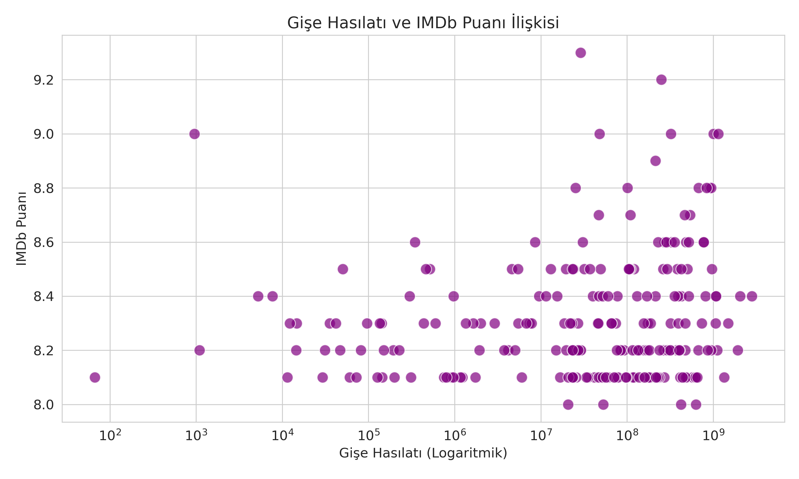

Projenin Amacı
Theodor Adorno'nun **"Kültür Endüstrisi"** teorisine göre; modern sanat artık ticari bir meta haline gelmiş ve fabrikasyon bir üretime dönüşmüştür. 

Bu projede, **IMDb Top 250** veri setini kullanarak sinemanın yıllar içindeki değişimini analiz ettik ve şu sorulara cevap aradık:
- Filmler standartlaşıyor mu?
- Sanatsal türler (Drama) yerini tüketim türlerine (Aksiyon) mi bırakıyor?
- Nitelik (Puan) mi önemli yoksa Popülarite (Gişe) mi?

---

## 📊 Bulgular ve Grafikler

### 1. Film Sürelerinin Standartlaşması
Veriyi incelediğimizde, film sürelerinin belirli bir ticari kalıba (standart pakete) oturduğunu görüyoruz. Endüstri, risk almamak için "tüketilmesi en kolay" süreleri tercih ediyor.

---

### 2. Türlerin Değişimi: Sanattan Eğlenceye
Projenin en çarpıcı bulgusu budur. 2000 öncesi (Yeşil) **Drama** ağırlıktayken, 2000 sonrasında (Turuncu) **Aksiyon ve Macera** patlama yapmıştır. Sinema, düşünen bireyden çok eğlenen tüketiciye hitap etmeye başlamıştır.

---

### 3. Gişe ve Puan İlişkisi (Sanat vs Meta)
Grafikte görüldüğü üzere, en çok hasılat yapan (sağ taraf) filmler her zaman en yüksek puanı alan (üst taraf) filmler değildir. Kültür endüstrisinde başarı, pazarlama bütçesiyle ölçülür.

---

## 💻 Kullanılan Teknolojiler
Bu analiz **Python** programlama dili kullanılarak yapılmıştır.
- **Pandas:** Veri temizleme ve manipülasyon.
- **Seaborn / Matplotlib:** Veri görselleştirme.

*Kodlara `analiz.py` dosyasından ulaşabilirsiniz.*
